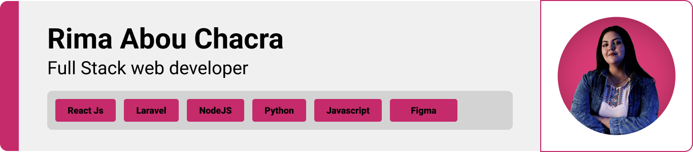
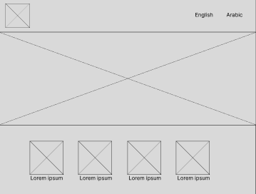
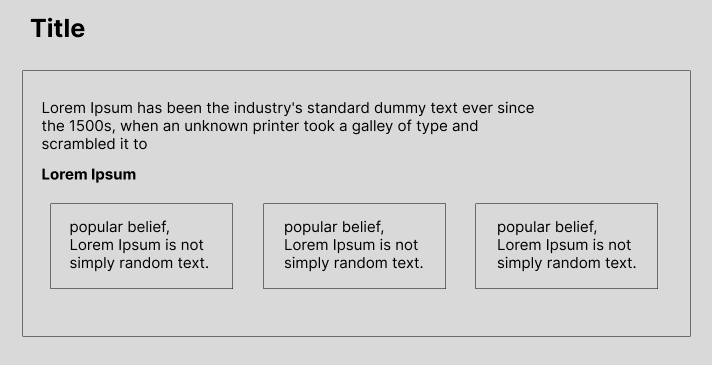
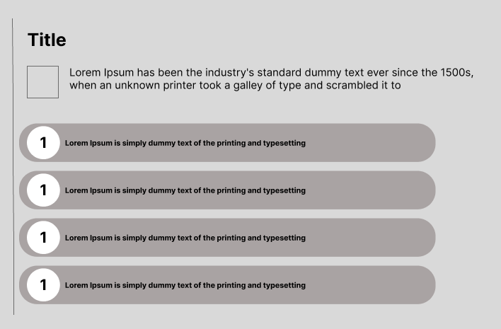
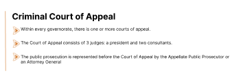

> <strong>Project Objective</strong>
>
> A web page designed to display content related to criminal court of appeal, with use of i18n for multiple language support

> I designed this page using wireframes and mockups, iterating on the design until I reached the ideal layout for easy navigation and a seamless user experience.

### Wireframes
| Section1  | Section2 |  Section3 
| ---| ---| ---| 
|  |  |  |

### Mockups
| Header  | Definition| Violations |
| ---| ---| ---|
|  |  |  |

> Using the wireframes and mockups I designed, I implemented this webpage

### User Screens (web)

| Video  | Register screen 
| ---| 
|  


- This project uses ReactJS for the frontend. ReactJS is a popular JavaScript library for building user interfaces.
- For persistent storage, the web page uses Firebase firestore to store data.
- React-router is used for different language paths
- i18n is used for multiple language support.
- Mui (material ui) is used library for styled components. 
- Flaticon is used for every icon


> To set up this page, follow these steps:

### Prerequisites

This is an example of how to list things you need to use the software and how to install them.
* npm
  ```sh
  npm install npm@latest -g
  ```

### Installation

_Below is an example of how you can instruct your audience on installing and setting up your app. This template doesn't rely on any external dependencies or services._

1. Clone the project repository
   ```sh
   git clone https://github.com/rimaabouchacra/web-assessment.git
   ```
2. For React Install NPM packages
   ```sh
   cd web assessment
   cd frontend
   npm install
   ```
3. Start the server for React:

   ```sh
   cd frontend
   npm start