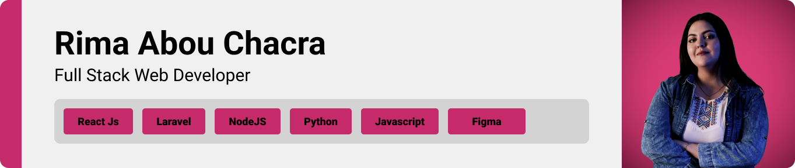
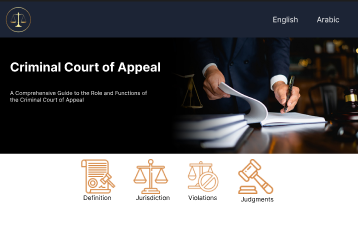
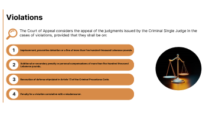

> <strong>Project Objective</strong>
>
> A web page designed to display content related to criminal court of appeal, with use of i18n for multiple language support

> I designed this page using wireframes and mockups, iterating on the design until I reached the ideal layout for easy navigation and a seamless user experience.

### Wireframes
| Section1  | Section2 |  Section3 
| ---| ---| ---| 
|  |  |  |

### Mockups
| Header  | Definition| Violations |
| ---| ---| ---|
|  |  |  |

> Using the wireframes and mockups I designed, I implemented this webpage

### User Screens (web)
| video
| ---|  
|  |

- This project uses ReactJS for the frontend. ReactJS is a popular JavaScript library for building user interfaces.
- For persistent storage, the web page uses Firebase firestore to store data.
- React-router is used for different language paths
- i18n is used for multiple language support.
- Mui (material ui) is used library for styled components. 
- Flaticon is used for every icon
